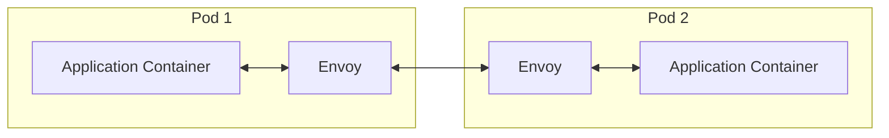

## Background
At work, we recently decided to upgrade Spring Boot (SB) from version 3.3.x to 3.4 for our services. We did the upgrade for one of the services, tested everything locally and deployed it to our QA environment. We use Kubernetes and the [Istio](https://istio.io/latest/docs/) service mesh for all our environments, which becomes important later, as you’ll see.

Everything was running smoothly until we started encountering `403 Forbidden` responses for `GET` calls made over HTTP. Rolling back the deployment image to the previous version which used SB 3.3.x magically resolved the issue. What made this error weirder and hard to debug was that it never occurred on anyone's local machine.

Upon reviewing the service logs, the 403 error included a status text of **"upgrade_failed"**. So i had a few questions:
1. Why was my service trying to upgrade the connection?
2. What was it trying to upgrade to?
3. Who was sending the 403 response — was it the target server we were calling?

And i went down the rabbit hole.

## Why, what and who is trying to upgrade my HTTP connection?
Our SB service uses the [RestTemplate](https://docs.spring.io/spring-framework/docs/current/javadoc-api/org/springframework/web/client/RestTemplate.html) abstraction with the Apache [httpcomponents-client](https://hc.apache.org/httpcomponents-client-5.4.x/) library underlying it. Fortunately, debugging the HttpClient library is straightforward. You can just add this in the `logback-spring.xml` file:
```xml
...
<logger name="org.apache.hc.client5.http" level="debug"/>
...
```
With this in place, I ran the service locally. The debug logs revealed that the library was attempting to upgrade the connection to a secure mode (i.e. over TLS):
```text
20:11:32.560 [main] DEBUG org.apache.hc.client5.http.impl.io.PoolingHttpClientConnectionManager -- ep-0000000001 connecting endpoint to http://postman-echo.com:80 (3 MINUTES)
...
20:11:32.565 [main] DEBUG org.apache.hc.client5.http.protocol.RequestUpgrade -- Connection is upgradable: protocol version = HTTP/1.1
20:11:32.565 [main] DEBUG org.apache.hc.client5.http.protocol.RequestUpgrade -- Connection is upgradable to TLS: method = GET
...
20:11:32.568 [main] DEBUG org.apache.hc.client5.http.headers -- http-outgoing-0 >> GET /get HTTP/1.1
20:11:32.568 [main] DEBUG org.apache.hc.client5.http.headers -- http-outgoing-0 >> Accept-Encoding: gzip, x-gzip, deflate
20:11:32.568 [main] DEBUG org.apache.hc.client5.http.headers -- http-outgoing-0 >> Host: postman-echo.com
20:11:32.568 [main] DEBUG org.apache.hc.client5.http.headers -- http-outgoing-0 >> Connection: keep-alive
20:11:32.568 [main] DEBUG org.apache.hc.client5.http.headers -- http-outgoing-0 >> User-Agent: Apache-HttpClient/5.4.1 (Java/21.0.2)
20:11:32.568 [main] DEBUG org.apache.hc.client5.http.headers -- http-outgoing-0 >> Upgrade: TLS/1.2
20:11:32.568 [main] DEBUG org.apache.hc.client5.http.headers -- http-outgoing-0 >> Connection: Upgrade
```

Wait, what? When did this behavior get introduced?

Since we hadn’t explicitly set a version for the `org.apache.httpcomponents.client5.httpclient5` dependency in our `build.gradle` file, the [Spring Managed Dependency Coordinates page](https://docs.spring.io/spring-boot/appendix/dependency-versions/coordinates.html) revealed that version 5.4.1 was being used. Reviewing the [release notes](https://downloads.apache.org/httpcomponents/httpclient/RELEASE_NOTES-5.4.x.txt) for this version, i found nothing regarding TLS upgrades. However, release 5.4 did include this significant change:

> **Support for RFC 2817 (Upgrading to TLS Within HTTP/1.1).**

Examining the relevant [Git commit](https://github.com/apache/httpcomponents-client/pull/542/files#diff-fc473f5c7024af369d3c007cca5c86026ec0309ab343cd118ad021007a9b2f4e) revealed that the `RequestUpgrade.java` class was now sending `Upgrade: TLS/1.2` headers by default for `GET`, `HEAD`, and `OPTIONS` methods over HTTP/1.x (where x ≥ 1).

## What's RFC 2817?
The abstract of [the memo](https://datatracker.ietf.org/doc/html/rfc2817) states (I have extracted the parts which i felt are relevant here):
>  This memo explains how to use the Upgrade mechanism in HTTP/1.1 to initiate Transport Layer Security (TLS) over an existing TCP connection. This allows unsecured and secured HTTP traffic to share the same well known port (in this case, http: at 80 rather than https: at 443).
...

> This memo does NOT affect the current definition of the 'https' URI scheme, which already defines a separate namespace (http://example.org/ and https://example.org/ are not equivalent).

In the section on [Client Requested Upgrade to HTTP over TLS](https://datatracker.ietf.org/doc/html/rfc2817#autoid-4), it is stated that the client can request an **Optional Upgrade** to TLS and:
> In this case, the server MAY respond to the clear HTTP operation normally, OR switch to secured operation

which basically means that the server can either choose to ignore the client's request to switch protocols or honor it by sending an intermediate `101 Switching Protocol` response.

But why were we receiving a 403 instead—and from whom?

## Who was sending the 403 response?

So if you know your Istio, then you might also know that:
1. It runs the Envoy proxy as a sidecar.
2. Your application container in one pod never communicates with an application in another pod or with an external service directly. Everything is redirected through the Envoy proxy!


Was Envoy rejecting the HTTP requests from my service??

Sure enough, a quick search in the Envoy repository led to this open issue: [HTTP/1.1 TLS Upgrade (RFC-2817) causes upgrade_failed](https://github.com/envoyproxy/envoy/issues/36305). **Envoy rejects requests containing `Upgrade: <some value>` and `Connection: Upgrade` headers instead of ignoring these headers**. The justification provided by the Envoy maintainers for this is security and to avoid [HTTP request smuggling](https://en.wikipedia.org/wiki/HTTP_request_smuggling).

## Fixing the error
Since the Envoy issue remains unresolved (with [discussions happening](https://github.com/envoyproxy/envoy/pull/37642#pullrequestreview-2505005646) around how to handle different values of the `Upgrade` header), we had to address the problem on the application side. [The solution](https://github.com/spring-projects/spring-boot/wiki/Spring-Boot-3.4-Release-Notes#apache-http-components-and-envoy) provided by the Spring team involves using a customizer for the HttpClient factory builder and setting the `protocolUpgradeEnabled` field to false, or you can also do:
```java
RequestConfig requestConfig = RequestConfig.
    custom().
    setProtocolUpgradeEnabled(false).
    build();
HttpClient httpClient = HttpClients.
    custom().
    setDefaultRequestConfig(requestConfig).
    build();
```

## Closing thoughts
1. Explicitly provide package versions wherever possible. Although this bug did not make it to production, it could have been avoided if we had kept the version of `org.apache.httpcomponents.client5.httpclient5` locked at 5.3 and just focused on the SB upgrade from 3.3.x to 3.4.
2. Read release notes before upgrading. In this case, maintainers of both Apache HttpClient & SB had provided details about the protocol upgrade change (the SB maintainers updated the release notes once the issue was discovered).
3. You never know what you might break by changing the default behaviour or introducing a new default with a minor update of your public API. Always err on the side of extreme caution and keep defaults as off/false. The Apache httpcomponents maintainers could have kept the `protocolUpgradeEnabled` field as false by default in the 5.4 release.
4. Deviating from the RFC and introducing new behaviour might not be a good idea. The whole Envoy discussion around rejecting requests with the `Upgrade` header for the sake of strict security brings up the question of how you interpret specifications. While the RFC says that the server may ignore the `Upgrade` header, it doesn't say if the server can/should/should not reject such requests entirely. All other proxies such as nginx, traefik, haproxy just ignore this header. So Envoy definitely made an unconventional choice.
5. With deployment setups that use Istio and Envoy, testing something on your local machine with Docker/Kubernetes might not be enough. This opens up a new class of (hard to debug) bugs where something works on your machine and your co-worker's, but you push something to your cluster and it breaks. One overly complicated solution to this would be to run Istio on your local setup with the same configuration as the one that your team/organization uses in their cluster.
